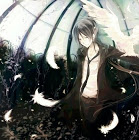

# SpaceShooter
**Unity를 이용한 FPS 슈팅 게임**

안녕하세요!  
Unity를 이용하여 만든 슈팅 게임입니다.  

***
***SpaceShooter 게임 영상*** / ***Video of the SpaceShooter game***

***
**게임소개**
<ul> 1.게임시작화면  
게임 시작화면에서 게임시작을 눌러야 게임이 시작됩니다.  
설정 버튼 애니메이션을 통해 버튼을 누르는 효과를 추가하였습니다.  
설정 화면에서 배경음과 효과음을 On, Off 할 수 있습니다.  
</ul>

<ul> 2.플레이어  
플레이어는 총을 바꿀 수 있습니다.  
총을 쏠 때 어느 방향으로 가는지 볼 수 있습니다.  
인벤토리를 열어 아이템을 장착할 수 있습니다.  
적을 처치 함에 따라 킬 수가 올라갑니다.  
</ul>

<ul> 3.적  
적은 최대 3명이 랜덤된 위치에 소환됩니다.  
일정 범위 내에 플레이어가 없으면 찾으러 돌아다니고 범위 내 발각 되면 총을 쏘러 달려갑니다.  
플레이어를 죽이게 되면 신나는 춤을 추게 됩니다.  
플레이어가 죽을때 까지 계속 부활합니다 
</ul>

<ul> 4.플레이어 & 적 공통점  
HP를 가지고 있어 바로 죽지 않습니다.  
총알 수가 존재하여 다 쓰게 되면 장전을 합니다.  
</ul>

<ul> 5.일시정지  
갑작스럽게 게임을 하지 못하게 된다면 일시정지를 눌러 게임을 멈추고 다시 시작하실 수 있습니다.  
</ul>

<ul> 6.기타 기능  
드럼통을 3대 타격시 폭발하는 생생한 이펙트가 있습니다.   
깔끔한 디자인의 인벤토리는 아이템을 옮길 때 원하는 위치에 옮길 수 있습니다.  
PlayerPrefs 저장으로 킬 수가 저장되어 게임을 껏다켜도 초기화되지 않습니다.  
</ul>

***

### 적을 처치하여 최대한 많은 킬 수를 기록해보세요! 죽게 된다면 적들이 놀리게 될거예요.

***

궁금한 점 및 요청사항은 아래 이메일을 참고해주세요 
구글 이메일 tnwls9721@gmil.com 
네이버 이메일 chfhrtorthsk@naver.com 

***
## Engilsh
# SpaceShooter
**FPS Shooting Game with Unity**

Hello!  
It's a shooting game made using Unity.  

**Introduction to the Games**
<Ul> 1. Game start screen  
On the game start screen, you must click Start to start the game.  
Animation of the setup button has added the effect of pressing the button.  
Background sounds and effects can be turned on and off from the setup screen.  
</ul>

<Ul> 2.player  
The player can change the gun.  
You can see which direction it is going when you shoot.  
You can open the inventory to mount the item.  
The number of kills increases as we destroy the enemy.  
</ul>

<Ul> 3. Enemy  
Up to 3 people are recalled to random locations.  
If you don't have a player within a certain range, you go around looking for it, and if you're caught in a range, you run to shoot.  
If you kill the player, you'll have fun dancing.  
It will continue to resurrect until the player dies.  
</ul>

<Ul> 4.Player & Enemy in Common  
I have HP, so I won't die right away.  
There's a number of bullets, so when they're finished, they load.  
</ul>

<Ul> 5.Pause  
If you suddenly lose the game, you can press pause to stop and restart the game.  
</ul>

<Ul> 6.Other functions  
There's a vivid effect that explodes when you hit three drums.  
A clean design’s inventory can be moved to the desired location when moving an item.  
PlayerPreps store saves the kill count and does not reset when the game is turned off.  
</ul>

***

### Eliminate the Enemy and record as many kills as you can! If you die, your enemies will make fun of you.

***

Please refer to the email below for questions and requests.  
Google Email tnwls9721@gmil.com tnwls9721@gmil.com  
Naver e-mail chfhrtorthsk@naver.com

***

